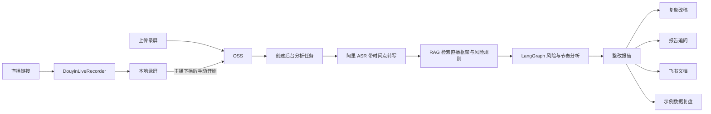

# AI 知识付费直播复盘

面向 AI 课程、训练营和陪跑类直播间的 Web 端复盘工具。用户提交直播链接或录屏后，系统生成带时间点逐字稿，定位违禁词与语义风险，对照知识付费直播框架检查节奏，并给出主播可以直接使用的整改话术。

这是一个 AI 产品经理作品集项目，目标不是做通用内容审核平台，而是在“AI 知识付费直播”这个垂直场景里跑通从录制、识别、检索、分析到整改的完整闭环。

## 核心能力

- 直播链接录制：调用 [DouyinLiveRecorder](https://github.com/ihmily/DouyinLiveRecorder)，主播下播后手动开始复盘。
- 录屏直接上传：浏览器上传常见音视频文件，文件通过 OSS 提供给 ASR。
- 长任务处理：录屏分析在后端异步执行，页面轮询任务状态，避免长视频转写被单次 HTTP 超时打断。
- 带时间点转写：阿里百炼 `paraformer-v2` 输出句子级开始与结束时间。
- RAG 检索：`text-embedding-v4` 向量化内置框架、风险规则和案例边界，Embedding 不可用时回退到关键词检索。
- Agent 工作流：LangGraph 编排转写整理、框架检索、风险判断和整改建议四个节点。
- 双层风险判断：确定性违禁词扫描 + DeepSeek 上下文语义风险判断。
- 框架节奏分析：按原话出现时间、文字量和语义证据判断直播阶段是否覆盖。
- 可执行结果：展示原话、风险原因、推荐说法、下一场行动清单和复盘改稿。
- 报告追问：围绕本场逐字稿、风险点和时间轴继续追问。
- 飞书沉淀：配置飞书应用后创建复盘文档；未配置时展示文档预览。
- 数据复盘演示：用明确标注的模拟数据演示在线、互动和话术时间轴的对照，真实第三方数据接口尚未接入。

## 用户流程



## 技术架构

| 层级     | 实现                                                   |
| -------- | ------------------------------------------------------ |
| Web      | React 19、Vite、Tailwind CSS、Radix UI、Recharts       |
| API      | NestJS、TypeScript                                     |
| 长任务   | 进程内分析任务 + 前端状态轮询                          |
| 工作流   | LangChain、LangGraph                                   |
| ASR      | 阿里百炼 `paraformer-v2`                               |
| RAG      | 阿里 `text-embedding-v4` + 进程内向量索引 + 关键词兜底 |
| 语义分析 | DeepSeek Chat Completions                              |
| 文件中转 | 阿里 OSS 签名 URL                                      |
| 直播录制 | DouyinLiveRecorder 外部进程                            |
| 协作输出 | 飞书云文档 API                                         |

## 本地运行

### 1. 环境要求

- Node.js 22+
- npm 10+
- Python 3.10+
- FFmpeg
- 阿里百炼 API Key
- 阿里 OSS Bucket 与最小权限 AccessKey
- DeepSeek API Key
- 可选：飞书开放平台应用

### 2. 安装项目

```bash
npm install
cp .env.example .env.local
```

只在 `.env.local` 中填写真实密钥。仓库会忽略所有本地环境文件，只保留空值示例。

### 3. 安装直播录制工具

```bash
git clone https://github.com/ihmily/DouyinLiveRecorder.git tools/DouyinLiveRecorder
python3 -m venv tools/DouyinLiveRecorder/.venv
tools/DouyinLiveRecorder/.venv/bin/python -m pip install -r tools/DouyinLiveRecorder/requirements.txt
```

然后在 `.env.local` 中配置：

```bash
DOUYIN_LIVE_RECORDER_PATH=./tools/DouyinLiveRecorder
DOUYIN_LIVE_RECORDER_PYTHON=./tools/DouyinLiveRecorder/.venv/bin/python
```

外部录制工具目录不会提交到本仓库。详细说明见 [docs/live-recorder-setup.md](docs/live-recorder-setup.md)。

### 4. 配置云服务

参考 [.env.example](.env.example) 填写：

```bash
ALIYUN_DASHSCOPE_API_KEY=
ALIYUN_OSS_ACCESS_KEY_ID=
ALIYUN_OSS_ACCESS_KEY_SECRET=
ALIYUN_OSS_BUCKET=
ALIYUN_OSS_REGION=
ALIYUN_OSS_ENDPOINT=
DEEPSEEK_API_KEY=
```

ASR 与 OSS 说明见 [docs/aliyun-asr-setup.md](docs/aliyun-asr-setup.md)。

### 5. 启动

```bash
npm run dev:local
```

默认访问地址：

```text
http://localhost:8081/app/app_179b24s0sng/
```

首次体验可以直接点击页面右上角的“先看完整示例”。该入口使用内置时间戳样例和确定性演示报告，不消耗外部模型额度；上传真实录屏时才会调用 OSS、ASR、Embedding 与 DeepSeek 链路。

## 质量检查

```bash
npm run check
npm run build:prod
```

GitHub Actions 会在 push 和 pull request 时自动执行代码规范检查、类型检查、单元测试和生产构建。

## 目录结构

```text
client/src/pages/dashboard/      用户入口与复盘工作台
server/modules/recorder/         直播录制任务封装
server/modules/storage/          OSS 上传与本地文件边界
server/modules/analysis/         ASR、RAG、LangGraph、DeepSeek 分析
server/modules/analytics/        示例第三方数据复盘接口
server/modules/feishu/           飞书文档生成与预览
shared/api.interface.ts          前后端共享协议
docs/                            云服务和录制工具接入说明
```

## 数据真实性

- 录屏上传、OSS、阿里 ASR、Embedding、DeepSeek 分析均为真实接口链路。
- “完整示例”使用内置逐字稿和演示结果，保证未配置密钥时也能稳定体验完整报告界面。
- “直播数据复盘”当前是产品演示数据，页面和接口都会明确标注为“示例第三方数据”。
- 飞书未配置时只生成预览，不会声称已经创建真实文档。

## 当前边界

- 一次只运行一个直播录制任务，录制任务状态保存在进程内。
- 录屏分析任务同样保存在进程内，适合个人项目与单机演示；服务重启会丢失进行中的任务，生产环境应替换为 Redis/BullMQ 等持久化任务队列。
- 内置违禁词仍是 MVP 样例，需要持续补充正式规则库。
- 向量索引当前保存在进程内，服务重启后重新生成；尚未接入 Chroma、Milvus 等持久化向量数据库。
- 暂不分析直播画面、字幕贴片和商品信息，只分析音频转写文本。
- 暂不提供多租户登录、历史报告管理、计费和平台级录制稳定性保障。
- 真实第三方直播数据需要后续实现数据源适配器或 CSV 导入。

## 安全说明

- 不要提交 `.env.local`、录屏、日志或 OSS 签名 URL。
- 后端只允许把 `.local/recorder-runs` 中由本项目生成的音视频上传到 OSS。
- 浏览器上传的临时文件在 OSS 上传完成后会立即删除。
- 只分析自己有权处理的直播内容，并遵守平台规则与相关法律。

## 后续路线

1. 导入可版本化的正式违禁词与行业规则库。
2. 接入持久化向量数据库，并支持用户上传框架文档。
3. 增加 CSV/第三方数据适配器，把真实在线与成交数据对齐到时间轴。
4. 保存历史报告，增加认证、限流、持久化任务队列和失败重试。
