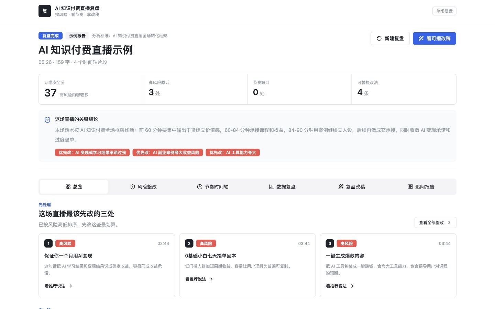
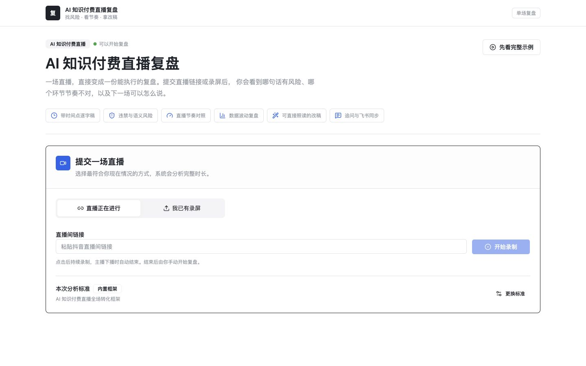
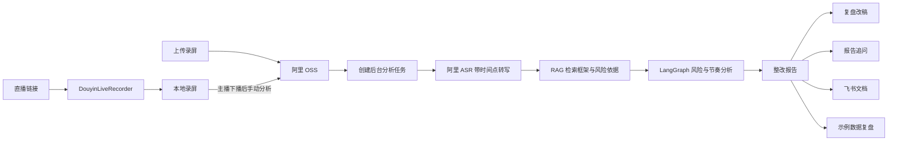
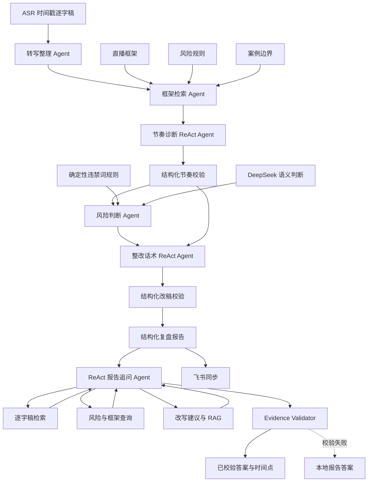
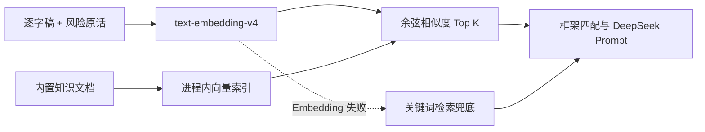

# AI 知识付费直播复盘

[](https://github.com/1killermouse/ai-livestream-review/actions/workflows/ci.yml)


[](LICENSE)

面向 AI 课程、训练营和陪跑类直播间的 Web 端复盘工具。用户提交直播链接或录屏后，系统生成带时间点逐字稿，定位违禁词与上下文语义风险，对照知识付费直播框架检查节奏，并给出主播可以直接使用的整改话术。

产品不做通用内容审核，而是在“AI 知识付费直播”这个垂直场景里，跑通从录制、转写、检索、分析到整改、追问和历史沉淀的完整闭环。



## 项目解决什么问题

知识付费主播复盘一场长直播时，通常要反复拖动录屏、手工找风险话术，再凭经验判断节奏。这个过程有三个明显问题：

1. **找不到具体位置**：只知道“这场讲得不好”，不知道是哪一分钟、哪一句话出了问题。
2. **合规和转化割裂**：违禁词工具只做字符串匹配，无法判断收益暗示、案例夸大和过度逼单等上下文风险。
3. **报告不能执行**：很多分析只给结论，没有主播下一场可以直接照着说的替换话术。

本项目将输出统一到一份带时间轴的行动报告中：

- 哪句话存在风险，以及对应录屏时间点。
- 为什么有风险，是违禁词、语义风险还是框架缺口。
- 当前直播节奏覆盖了哪些阶段，哪些阶段尚未到达或需要加强。
- 下一场应该保留什么、删掉什么、具体怎么改。
- 主播可以继续追问本场直播，回答仍然引用原话和时间点。

## 快速体验

只体验产品界面和完整示例时，不需要配置数据库、ASR、Embedding、DeepSeek 或 OSS 密钥。独立模式会把账号和历史报告保存在本机 `.local/standalone-data.json`：

```bash
git clone https://github.com/1killermouse/ai-livestream-review.git
cd ai-livestream-review
npm ci --ignore-scripts
cp .env.example .env.local
npm run dev:standalone
```

打开：

```text
http://127.0.0.1:8081/app/
```

第一次打开先创建管理员账号，之后点击“先看完整示例”即可查看完整报告。该入口使用内置时间戳逐字稿和确定性演示结果，不消耗 ASR、Embedding 或 DeepSeek 额度。

<details>
<summary>查看提交直播界面</summary>



</details>

## 产品闭环



### 用户操作路径

1. 使用内部账号登录；管理员可以创建主播账号，主播只查看自己的历史复盘。
2. 选择“直播正在进行”或“我已有录屏”。
3. 直播链接模式启动录制，主播下播后手动开始复盘；录屏模式直接上传文件。
4. 选择内置 AI 知识付费框架，或输入本场要使用的自定义框架文本。
5. 页面持续展示分析进度，后端完成 ASR、RAG、风险判断和整改生成并自动保存。
6. 查看总览、风险整改、节奏时间轴、数据复盘、复盘改稿和报告追问，之后可从历史记录再次打开。

## 能力状态

| 能力               | 状态   | 当前实现                                           |
| ------------------ | ------ | -------------------------------------------------- |
| 抖音直播链接录制   | 已接入 | 封装 DouyinLiveRecorder 外部进程，轮询录制状态     |
| 本地录屏上传       | 已接入 | 4 MB 分片并发上传，失败自动重试，单文件上限 2 GB   |
| 文件中转           | 已接入 | 阿里 OSS 上传与签名 URL                            |
| 带时间点 ASR       | 已接入 | 阿里百炼 `paraformer-v2`，保留句子开始和结束时间   |
| RAG                | 已接入 | `text-embedding-v4` + 进程内向量索引 + 关键词兜底  |
| 违禁词判断         | 已接入 | 本地确定性规则，当前词库为 MVP 样例                |
| 语义风险判断       | 已接入 | DeepSeek 结合逐字稿、框架和 RAG 依据输出结构化风险 |
| 直播节奏判断       | 已接入 | ASR 时间戳为主，文字量和语义证据为辅               |
| 自定义分析框架     | 已接入 | 支持单场输入框架文本，暂未做文档持久化             |
| 后台长任务         | 已接入 | 进程内任务状态 + 前端每 2 秒轮询                   |
| 报告追问           | 已接入 | 意图路由引导 ReAct 查证，回答并返回参考时间点     |
| 飞书同步           | 已接入 | 配置飞书应用后创建文档；未配置时明确显示预览       |
| 第三方直播数据     | 演示   | 使用明确标注的模拟数据，预留真实数据适配器         |
| 画面与贴片识别     | 未接入 | 当前只分析音频转写文本                             |
| 内部账号与历史报告 | 已接入 | 管理员创建账号；主播仅查看自己的持久化报告         |
| 计费与公网注册     | 未接入 | 当前定位为内部使用的单机 MVP                       |

## 报告包含什么

### 1. 总览

- 话术安全分和风险等级。
- 高风险原话、节奏缺口、可替换改法数量。
- 本场关键结论和下一场行动清单。

### 2. 风险整改

- 原话和发生时间。
- 风险类型、风险等级和命中规则。
- 风险原因、修改建议和可直接替换的话术。

### 3. 节奏时间轴

- 每个框架阶段的建议时间窗口。
- `已覆盖 / 需要加强 / 缺失 / 暂不判断` 四种状态。
- 带开始时间、结束时间、字数和风险标签的逐字稿时间轴。

### 4. 数据复盘

- 在线、互动、点击和成交线索的示例曲线。
- 数据变化与风险话术时间点对齐。
- 当前为产品演示数据，不冒充蝉妈妈、考古加等真实数据源。

### 5. 复盘改稿

- 主播下一场可以直接复制的整段复盘话术。
- 飞书文档标题、关键结论、整改清单和时间轴预览。

### 6. 报告追问

- 支持追问“最该先改哪三处”“课程承接哪里最弱”等具体问题。
- 回答引用本场逐字稿、风险点、框架结果和对应时间点。
- 报告没有依据时明确说明，不编造直播内容。

## 关键产品判断

### 为什么不只用文字量判断直播节奏

文字量只能粗略反映内容密度，不能准确代表时长。主播语速、停顿、互动和等待下单都会造成明显偏差。因此本项目采用：

1. **ASR 时间戳作为主依据**：直接使用每句话的真实开始和结束时间。
2. **文字量作为辅助指标**：判断同一时间段内的信息密度，而不是反推绝对时长。
3. **语义证据判断阶段**：确认主播是在讲干货、课程权益、案例，还是成交承接。
4. **短录屏不强判缺失**：尚未进入 60 分钟、84 分钟或 90 分钟窗口时，返回“暂不判断”。

### 为什么只在高价值节点使用 Agent

主报告分析在 LangGraph 中保留五个职责清晰的节点，节奏诊断和整改话术使用受控 ReAct，其余节点保持确定性：

| 节点 | 职责 | 主要实现 |
| --- | --- | --- |
| 转写整理 Agent | 清洗 ASR 结果，保留时间戳、字数和阶段标签 | 确定性代码 |
| 框架检索 Agent | 对齐直播框架并召回风险规则、案例边界和改写依据 | RAG + 规则 |
| 节奏诊断 Agent | 自主检查时间窗、阶段证据与知识依据，提交实际时段和节奏结论 | ReAct + 结构化校验 |
| 风险判断 Agent | 合并违禁词规则与上下文语义风险 | 本地规则 + DeepSeek |
| 整改话术 Agent | 读取风险、节奏、原话和 RAG 依据，生成逐句替换与整段可播改稿 | ReAct + 结构化校验 |

三个 ReAct Agent 都有明确边界：节奏和整改位于主 LangGraph，报告追问独立运行。它们只能调用指定工具、必须提交结构化结果、必须引用已读取的报告证据，失败后回到时间戳规则、本地改稿或本地报告答案，不允许多个 Agent 自由对话。

### 为什么示例报告不调用外部模型

示例入口的目标是让第一次访问者稳定理解产品，而不是消耗 API 额度。真实录屏走完整云服务链路，示例报告使用内置数据。两者在界面和 README 中明确区分，避免把模拟结果包装成真实分析。

## AI 与 Agent 架构



### 节奏与整改 ReAct 策略

1. 节奏 Agent 先查看框架阶段和 5 分钟时间窗，再按需要检索具体逐字稿和 RAG 依据。
2. 节奏结果必须提交阶段名、状态、节奏问题、证据逐字稿 ID、建议和置信度；实际开始与结束时间由服务端根据证据 ID 重新计算。
3. 整改 Agent 必须读取风险点和节奏结果，再按需要查看风险点前后语境及 RAG 改写依据。
4. 整改结果同时包含逐条替换话术和整段可播改稿；新增收益保证、伪造证据或引用不存在的阶段会被拒绝。
5. 任一 ReAct 调用、提交或校验失败时，分别回退到时间戳规则和本地改稿，整份报告仍可生成。

### ReAct 追问策略

1. 轻量意图路由先把问题分成风险定位、风险解释、改写、节奏、总结行动和未知六类，不额外调用模型。
2. 路由结果只决定工具优先级，不会删除其他工具；模糊问题仍由 ReAct 继续查证。
3. 涉及原话、风险、节奏或改写时，必须先调用对应工具取证。
4. Agent 必须通过 `submit_report_answer` 提交答案、逐字稿 ID、风险项 ID、框架阶段和置信度。
5. Evidence Validator 按意图检查所需证据，并核对 ID、原话、时间点及引用/否定语境。
6. 未提交结构化答案、校验失败或 Agent 异常时，直接返回复用同一意图的本地答案，不放行未校验模型文本。
7. 服务端会去掉 Markdown 符号，并将“一定限流/封禁”等过度确定表达收敛为风险提示。

### 风险判断策略

风险结果不是完全交给大模型自由生成，而是采用双层判断：

1. 本地正则和规则先识别保证收益、极限词、虚假稀缺、站外交易等确定性风险。
2. RAG 召回与当前话术最相关的框架、规则和案例边界。
3. DeepSeek 根据逐字稿、框架匹配和 RAG 依据返回 JSON 风险对象。
4. 服务端过滤非法类型和低质量字段，再与本地规则去重合并。
5. DeepSeek 不可用时保留本地规则结果，核心流程不会完全中断。

## RAG 设计

当前知识库聚焦 AI 知识付费直播，内置三类文档：

- `framework`：0-60 分钟干货、60-84 分钟课程权益、84-90 分钟案例人设、90 分钟后成交承接。
- `risk_rule`：收益承诺、案例夸大、AI 工具能力夸大、过度逼单和站外交易等规则。
- `case_sample`：宝妈副业、实体店转型自媒体等案例边界。

共享协议已预留 `rewrite_template` 类型。整改 Agent 当前使用风险规则、框架和案例边界作为改写依据；尚未把改写模板整理成独立、可维护的 RAG 文档库。

检索流程：



MVP 语料规模很小，因此暂未增加 Rerank，也没有为了技术名词额外引入独立服务。后续知识库扩大后，再迁移到持久化向量数据库并评估 Rerank 的收益。

## 长任务设计

长录屏的 ASR 和模型分析可能超过普通 HTTP 请求时限，因此真实录屏采用后台任务：

1. 前端上传文件并创建分析任务。
2. 后端立即返回任务 ID，在后台继续执行 ASR、RAG 和 DeepSeek。
3. 前端每 2 秒查询一次任务状态，最长等待 10 分钟。
4. 任务完成后返回完整报告；失败时返回可理解的错误信息。

当前任务保存在进程内，最多保留 20 个；创建新任务时会清理超过 24 小时的旧任务。该实现适合单机 MVP；生产环境应替换为 Redis、BullMQ 或云任务队列。

## 技术栈

| 层级      | 实现                                                |
| --------- | --------------------------------------------------- |
| Web       | React 19、Vite、Tailwind CSS、Radix UI、Recharts    |
| API       | NestJS、TypeScript                                  |
| 工作流    | LangChain、LangGraph                                |
| ASR       | 阿里百炼 `paraformer-v2`                            |
| Embedding | 阿里 `text-embedding-v4`，默认 1024 维              |
| 语义分析  | DeepSeek Chat Completions                           |
| 文件中转  | 阿里 OSS 签名 URL                                   |
| 直播录制  | DouyinLiveRecorder 外部进程                         |
| 协作输出  | 飞书云文档 API                                      |
| 测试与 CI | Jest、ESLint、Stylelint、TypeScript、GitHub Actions |

## 本地开发

### 环境要求

基础示例：

- Node.js 22+
- npm 10+

真实录屏分析：

- Python 3.10+
- FFmpeg
- 阿里百炼 API Key
- 阿里 OSS Bucket 与最小权限 AccessKey
- DeepSeek API Key
- 可选：飞书开放平台应用

### 安装依赖

```bash
npm ci --ignore-scripts
cp .env.example .env.local
```

`package-lock.json` 会锁定 Node 依赖版本。真实密钥只应写入 `.env.local`，不要提交到仓库。

`dev:standalone` 使用固定本地测试身份和本地 CSRF Cookie，不依赖妙搭登录；该行为只在独立开发进程启用，不影响沙箱或生产环境。

### 配置直播录制工具

```bash
npm run setup:local
```

该命令会创建 `.env.local`、下载项目验证过的 DouyinLiveRecorder 固定提交，并创建 Python 虚拟环境。外部工具目录已加入 `.gitignore`。详细说明见 [直播录制接入文档](docs/live-recorder-setup.md)。

### 环境变量

| 变量                           | 是否必需     | 用途                               |
| ------------------------------ | ------------ | ---------------------------------- |
| `ALIYUN_DASHSCOPE_API_KEY`     | 真实分析必需 | ASR 与 Embedding                   |
| `ALIYUN_ASR_MODEL`             | 可选         | 默认 `paraformer-v2`               |
| `ALIYUN_OSS_ACCESS_KEY_ID`     | 真实分析必需 | OSS 上传                           |
| `ALIYUN_OSS_ACCESS_KEY_SECRET` | 真实分析必需 | OSS 上传                           |
| `ALIYUN_OSS_BUCKET`            | 真实分析必需 | OSS Bucket                         |
| `ALIYUN_OSS_REGION`            | 真实分析必需 | OSS Region                         |
| `ALIYUN_OSS_ENDPOINT`          | 真实分析必需 | OSS Endpoint                       |
| `ALIYUN_EMBEDDING_MODEL`       | 可选         | 默认 `text-embedding-v4`           |
| `ALIYUN_EMBEDDING_DIMENSIONS`  | 可选         | 默认 1024                          |
| `DEEPSEEK_API_KEY`             | 建议         | 上下文语义风险与报告追问           |
| `DEEPSEEK_MODEL`               | 可选         | 默认 `deepseek-v4-flash`           |
| `DOUYIN_LIVE_RECORDER_PATH`    | 链接录制必需 | 外部录制工具目录                   |
| `DOUYIN_LIVE_RECORDER_PYTHON`  | 链接录制必需 | 录制工具 Python 路径               |
| `FEISHU_APP_ID`                | 飞书同步必需 | 飞书应用 ID                        |
| `FEISHU_APP_SECRET`            | 飞书同步必需 | 飞书应用密钥                       |
| `FEISHU_DOC_FOLDER_TOKEN`      | 可选         | 指定飞书文档目录                   |
| `SUDA_DATABASE_URL`            | 部署建议     | PostgreSQL 连接地址                |
| `STANDALONE_STORE_PATH`        | 可选         | 本地账号与历史数据文件路径         |
| `LOG_REQUEST_BODY`             | 可选         | 默认 `false`，避免日志记录业务内容 |
| `LOG_RESPONSE_BODY`            | 可选         | 默认 `false`，避免日志记录报告全文 |

完整空值模板见 [.env.example](.env.example)，ASR 与 OSS 配置见 [阿里云接入文档](docs/aliyun-asr-setup.md)。

### 启动与构建

```bash
# GitHub 下载者推荐，不需要妙搭登录
npm run dev:standalone

# 妙搭本地开发，会尝试拉取平台环境
npm run dev:local

# 代码规范、类型检查和单元测试
npm run check

# 生产构建
npm run build:prod
```

## 关键 API

| Method | Endpoint                               | 用途                                   |
| ------ | -------------------------------------- | -------------------------------------- |
| `GET`  | `/api/analysis/capability`             | 查询 ASR、Embedding、DeepSeek 配置状态 |
| `POST` | `/api/analysis/prototype`              | 生成确定性完整示例报告                 |
| `POST` | `/api/analysis/jobs`                   | 创建真实录屏后台分析任务               |
| `GET`  | `/api/analysis/jobs/:id`               | 查询后台分析状态和结果                 |
| `POST` | `/api/analysis/chat`                   | 围绕本场报告继续追问                   |
| `POST` | `/api/storage/multipart/init`          | 创建浏览器录屏分片上传任务             |
| `POST` | `/api/storage/multipart/part`          | 上传单个录屏分片                       |
| `POST` | `/api/storage/multipart/complete`      | 合并分片并生成 OSS 签名地址            |
| `POST` | `/api/storage/multipart/abort`         | 取消并清理未完成的分片上传             |
| `POST` | `/api/storage/upload-local-file`       | 上传本项目录制目录中的音视频           |
| `POST` | `/api/recorder/capture`                | 启动直播链接录制                       |
| `GET`  | `/api/recorder/capture/:id`            | 查询直播录制状态                       |
| `POST` | `/api/analytics/mock-live-data-replay` | 生成明确标注的示例数据复盘             |
| `POST` | `/api/feishu/sync-report`              | 创建飞书文档或返回预览                 |
| `GET`  | `/api/auth/status`                     | 查询初始化与登录状态                   |
| `POST` | `/api/auth/login`                      | 内部账号登录                           |
| `POST` | `/api/auth/accounts`                   | 管理员创建主播账号                     |
| `GET`  | `/api/history/reports`                 | 按当前账号权限查询历史报告             |
| `GET`  | `/api/history/reports/:id`             | 打开一份有权限的历史报告               |

开发环境还提供 OpenAPI：

```text
http://127.0.0.1:8081/app/dev/openapi.json
```

## 项目结构

```text
client/src/api/                       前端 API 封装
client/src/pages/dashboard/           提交直播与复盘工作台
client/src/pages/history/             历史复盘列表
server/modules/auth/                  内部账号、会话与角色权限
server/modules/history/               报告持久化与历史查询
server/modules/recorder/              直播录制任务封装
server/modules/storage/               OSS 上传与本地文件安全边界
server/modules/analysis/              ASR、RAG、LangGraph、DeepSeek 与后台任务
server/modules/analytics/             示例第三方数据复盘
server/modules/feishu/                飞书文档生成与预览
server/database/                      MVP 数据结构与迁移
shared/api.interface.ts               前后端共享协议
docs/                                 云服务、录制工具和开发上下文
scripts/setup-local.js                固定版本外部工具初始化
scripts/dev-standalone.js             不依赖妙搭登录的本地启动器
.github/workflows/ci.yml              GitHub Actions 质量门禁
```

本地目录为什么与 GitHub 下载结果不同，以及如何恢复相同工具版本，见 [可复现说明](docs/reproducibility.md)。

## 测试与质量门禁

当前自动化覆盖：

- 分析后台任务能从 `processing` 正常进入 `completed` 并返回时间戳报告。
- 分析完成后自动保存到所属主播的历史记录。
- 模拟数据不能冒充真实第三方数据源。
- 本地文件上传不能越过录制目录边界。
- 录制器拒绝非 HTTP(S) URL 和带账号密码的 URL。

本地验收命令：

```bash
npm run check
npm run build:prod
```

GitHub Actions 会在 push 和 pull request 时执行 ESLint、Stylelint、前后端 TypeScript 检查、Jest 和生产构建。

## 数据真实性与口径

- 录屏上传、OSS、阿里 ASR、Embedding 和 DeepSeek 均有真实接口实现。
- “完整示例”使用内置逐字稿和演示结果，保证未配置密钥时也能稳定体验。
- “直播数据复盘”当前是模拟数据，页面和接口均标注“示例第三方数据”。
- 飞书未配置时只生成文档预览，不声称已经创建真实文档。
- 话术安全分是本项目的启发式评分，不代表抖音官方审核结论。
- 风险提示和整改建议只用于内容复盘，不构成法律或平台合规保证。

## 安全说明

- `.env`、`.env.local`、日志、录屏、临时文件和外部录制工具均已忽略。
- 后端只允许上传 `.local/recorder-runs` 中由本项目生成的音视频，阻止任意本地文件读取。
- 浏览器录屏按 4 MB 分片上传，每个临时分片在传入 OSS 后立即删除。
- 录制链接只接受 HTTP(S)，拒绝嵌入账号密码和异常换行的 URL。
- 当前使用内部账号认证，但没有公网注册、找回密码和限流，不应直接作为公网生产服务部署。
- 只处理自己有权录制和分析的直播内容，并遵守平台规则与相关法律。

漏洞报告方式见 [SECURITY.md](SECURITY.md)。提交代码前请阅读 [CONTRIBUTING.md](CONTRIBUTING.md)。

## 当前边界

- 一次只运行一个直播录制任务。
- 录制任务、分析任务和向量索引都保存在进程内，服务重启后不会恢复。
- 内置违禁词和行业规则仍是 MVP 样例，需要继续版本化维护。
- 自定义框架只在本次分析中使用，尚未提供文件解析、持久化和版本管理。
- 暂不分析直播画面、字幕贴片、商品信息和评论区内容。
- 暂不提供手机号注册、找回密码、计费、限流和平台级录制稳定性保障。
- 第三方直播数据尚未真实接入。
- 平台依赖仍有上游传递的依赖审计告警，生产化前需要随平台版本继续升级。

## 后续路线

1. 导入可版本化的正式违禁词和 AI 知识付费行业规则库。
2. 支持 Word、PDF、Markdown 框架文档解析、切块和版本管理。
3. 将进程内向量索引迁移到持久化向量数据库，并在语料扩大后评估 Rerank。
4. 增加 CSV 和第三方数据适配器，把真实在线、互动、点击与成交数据对齐到话术时间轴。
5. 将当前内部账号与报告兼容存储迁移为独立数据表，增加限流、持久化任务队列和失败重试。
6. 增加视频关键帧、字幕贴片和商品展示的多模态分析。

## 开源与声明

本项目使用 [MIT License](LICENSE)。

- 直播录制能力通过外部方式调用 [ihmily/DouyinLiveRecorder](https://github.com/ihmily/DouyinLiveRecorder)，该项目使用 MIT License，本仓库不复制其源码。
- “抖音”及相关平台名称归其权利人所有，本项目与抖音官方无隶属或背书关系。
- 阿里云、DeepSeek、飞书等服务需要使用者自行注册、配置并承担相应费用和合规责任。

## 参与贡献

欢迎提交 Issue 或 Pull Request。请不要在 Issue、截图、日志或提交记录中包含 API Key、AccessKey、直播签名 URL 或未经授权的直播内容。
