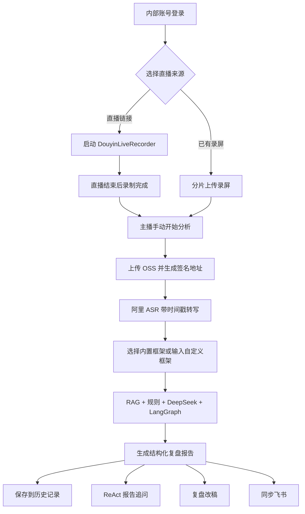

# AI 知识付费直播复盘：项目交接与文档写作底稿

> 更新时间：2026-07-16
> 项目性质：个人独立项目
> 当前阶段：垂直场景 MVP 已形成可演示闭环，尚未达到公网生产标准

## 1. 一段话带走

这是一个面向 AI 课程、训练营和陪跑类主播的播后复盘 Web 工具。主播提交抖音直播链接或上传直播录屏，系统通过阿里 ASR 生成带时间戳的逐字稿，再结合违禁词规则、AI 知识付费话术框架、RAG 检索和 DeepSeek 语义分析，定位风险原话与直播节奏问题，并输出主播下一场可以直接使用的整改话术。系统同时支持内部账号、历史报告、报告追问和飞书文档沉淀。

它不是通用内容审核平台，也不承诺替代抖音官方审核；核心价值是把“发现问题、定位时间点、解释原因、给出改法”连成一条垂直业务闭环。

## 2. 产品第一性原理

主播真正需要的不是一份技术报告，而是三个明确答案：

1. 这场直播哪一分钟、哪句话有问题？
2. 为什么有问题，是违规风险、语义风险还是节奏缺口？
3. 下一场应该怎么说，能不能直接照着改？

因此产品设计必须坚持：

- 时间点比抽象结论更重要。
- 可执行改法比风险数量更重要。
- 播后完整复盘优先于实时提醒。
- ASR 时间戳是节奏时长的主依据，文字量只表示信息密度。
- 确定性规则和大模型协同，不能把所有判断交给大模型自由生成。
- Agent 数量服从落地，不为了展示技术而增加不必要的自主规划。

## 3. 目标用户与权限

### 管理员

- 初始化内部管理账号。
- 创建主播账号。
- 查看全部主播的历史复盘。
- 发起新直播复盘。

### 主播

- 使用内部账号登录，不做手机号注册。
- 发起自己的直播复盘。
- 只查看自己的历史报告。
- 打开历史报告继续查看和追问。

当前账号系统适合内部试用，不包含公网注册、找回密码、账号冻结、复杂组织架构和计费。

## 4. 核心用户流程



关键交互逻辑：

1. 直播链接模式只负责开始录制和保存录屏，不强制自动分析。
2. 主播下播后，由用户手动点击“开始复盘”。
3. 无论录制多久都允许分析，不让用户选择分析时段。
4. 用户可以使用内置 AI 知识付费框架，也可以为本场输入自定义框架文本。
5. 报告自动绑定当前主播账号，后续从历史记录再次打开。

## 5. 当前功能真实性

| 能力 | 当前状态 | 真实边界 |
| --- | --- | --- |
| 直播链接录制 | 已接入 | 调用外部 DouyinLiveRecorder；不保证平台级稳定性 |
| 本地录屏上传 | 已接入 | 4 MB 分片、失败重试、单文件上限 2 GB |
| OSS 文件中转 | 已接入 | 使用阿里 OSS 和签名 URL |
| ASR | 已接入 | 阿里 `paraformer-v2`，保留句子起止时间 |
| 违禁词规则 | 已接入 | 当前是 AI 知识付费 MVP 词库，需要持续维护 |
| 语义风险 | 已接入 | DeepSeek 结构化分析，失败时退回本地规则 |
| RAG | 已接入 | `text-embedding-v4` + 进程内向量索引 + 关键词兜底 |
| LangGraph | 已接入 | 主分析为固定四节点；报告追问为工具调用型 ReAct Agent |
| 自定义框架 | 部分完成 | 支持单场文本输入，未做文档解析、持久化和版本管理 |
| 节奏分析 | 已接入 | 时间戳为主、文字量和语义为辅；短录屏不强判后续阶段缺失 |
| 报告追问 | 已接入 | 围绕当前报告和相关时间点回答 |
| 内部账号 | 已接入 | 管理员与主播两类角色 |
| 历史报告 | 已接入 | 管理员看全部，主播只看自己的报告 |
| 飞书同步 | 已接入 | 配置凭证后创建文档；未配置时只展示预览 |
| 第三方直播数据 | 演示 | 当前使用明确标注的模拟数据，尚未接真实数据源 |
| 视频画面识别 | 未接入 | 当前只分析音频转写文本 |
| 公网生产能力 | 未完成 | 缺少限流、任务队列、监控、找回密码和平台稳定性建设 |

不要在外部文档中把“示例报告”“模拟直播数据”描述成真实模型或真实第三方数据结果。

## 6. 报告信息架构

报告分为六个视图：

1. **总览**：安全分、高风险数量、节奏缺口、关键结论和行动清单。
2. **风险整改**：风险原话、发生时间、风险等级、判断依据、建议和替换话术。
3. **节奏时间轴**：框架阶段、建议时间窗、实际覆盖、逐字稿与风险标签。
4. **数据复盘**：当前为模拟数据，用于展示未来将数据波动与话术时间点对齐的能力。
5. **复盘改稿**：输出主播下一场可以直接使用的整段话术，并支持飞书沉淀。
6. **追问报告**：围绕本场直播继续问具体问题，回答返回参考时间点。

安全分是项目内部启发式评分，不是抖音官方合规分。

## 7. AI、RAG 与 Agent 的真实实现

### 四节点主分析工作流

| 节点 | 工作内容 | 是否调用模型 |
| --- | --- | --- |
| 转写整理 Agent | 清洗 ASR 分段、保留时间戳、补充阶段标签和字数 | 否，确定性代码 |
| 框架检索 Agent | 对齐框架阶段，召回框架、风险规则和案例边界 | Embedding；失败后关键词兜底 |
| 风险判断 Agent | 合并本地规则和 DeepSeek 语义风险 | 是 |
| 整改建议 Agent | 汇总替换建议并形成报告链路 | 目前主要使用上一步结构化结果 |

这条主链使用 LangGraph 的意义是让流程、状态和节点职责可观察、可替换，不让多个 Agent 自由对话。

### 报告追问 ReAct Agent

报告追问使用 LangGraph `createReactAgent`，可自主选择报告总览、逐字稿检索、风险查询、框架查询、改写建议和 RAG 知识检索六个查证工具，再通过第七个结构化提交工具返回答案和证据 ID。Evidence Validator 核对 ID、工具读取记录、原话、时间点以及引用/否定语境；未提交、校验失败或 Agent 异常时直接返回本地报告答案，不放行未校验模型文本。这是一个受控的单 Agent，不是多 Agent 自由协作。

### RAG 知识类型

- `framework`：AI 知识付费直播阶段框架。
- `risk_rule`：收益承诺、案例夸大、工具能力夸大、过度逼单、站外导流等。
- `case_sample`：宝妈副业、实体店转型等案例的合规表达边界。
- `rewrite_template`：协议已预留，尚未形成独立、可维护的模板库。

当前语料规模很小，所以不接 Rerank。知识库扩大后，再评估持久化向量数据库和 Rerank 是否真正改善召回质量。

### 风险判断策略

1. 本地规则先识别确定性风险。
2. RAG 召回当前话术最相关的框架和规则依据。
3. DeepSeek 输出结构化语义风险。
4. 服务端校验字段、过滤非法类型并去重。
5. DeepSeek 或 Embedding 失败时保留规则与关键词兜底。

## 8. 技术架构

| 层级 | 技术 |
| --- | --- |
| 前端 | React 19、Vite、TypeScript、Tailwind CSS、Radix UI、Recharts |
| 后端 | NestJS、TypeScript |
| 工作流 | LangChain、LangGraph |
| 数据库 | PostgreSQL、Drizzle；当前复用 `ruleDocuments` 存账号、会话和报告 |
| ASR | 阿里百炼 `paraformer-v2` |
| Embedding | 阿里 `text-embedding-v4`，默认 1024 维 |
| 语义模型 | DeepSeek Chat Completions |
| 文件 | 阿里 OSS |
| 直播录制 | 外部调用 `ihmily/DouyinLiveRecorder` |
| 协作输出 | 飞书云文档 API |
| 测试 | Jest、ESLint、Stylelint、TypeScript、GitHub Actions |

### 关键工程取舍

- 后台分析任务保存在进程内，最多 20 个，24 小时后清理；服务重启后任务会丢失。
- 向量索引保存在进程内，不是独立向量数据库。
- 长录屏通过后台任务和前端轮询处理，前端每 2 秒查询状态。
- 报告和账号已持久化，但当前借用兼容表结构，生产化应拆成独立表。
- 示例入口使用固定数据，不调用外部模型，保证低成本稳定演示。

## 9. 当前项目状态

### 完成度口径

- 垂直 MVP 演示闭环：约 85%。
- 可供真实小范围内部试用：约 65%。
- 公网生产就绪度：约 35%。

这些百分比是范围判断，不是正式项目度量。

### 最近一次验证

- ESLint、Stylelint、前后端 TypeScript 检查通过。
- Jest：6 个测试套件、11 项测试通过。
- 正式构建通过。
- 本地首页和登录状态接口返回 `200`。
- 浏览器验证：首页来源切换、框架设置、示例报告六个视图、历史空状态可正常使用，控制台无错误。

### 代码状态

- 仓库：`1killermouse/ai-livestream-review`。
- 当前本地分支：`sprint/default`。
- 当前远端 `main` 停在提交 `192c6bb`。
- 本地还有一轮未提交的 UI 优化，GitHub 暂时不是本机最新界面。
- 本地运行地址：`http://127.0.0.1:8081/app/`。
- 启动命令必须在项目目录执行：`npm run dev:standalone`。

不要把 `.env.local`、API Key、AccessKey、直播签名地址或真实录屏提交到 GitHub 或复制进公司文档。正式对外前应轮换曾用于开发测试的云服务密钥。

## 10. PRD 写作底稿

建议 PRD 按以下结构展开：

### 10.1 背景

知识付费直播复盘依赖人工拖动长录屏、查找风险原话和凭经验判断节奏，耗时长、结论不统一、报告难执行。普通违禁词工具只能匹配字符串，无法理解收益暗示、案例夸大和上下文语义风险。

### 10.2 用户问题

- 无法快速定位问题发生的时间点。
- 合规检查与转化节奏复盘相互割裂。
- 分析报告只讲问题，不提供主播可直接使用的改法。
- 复盘结果没有按主播沉淀，无法持续回看。

### 10.3 产品目标

- 将一场直播从录屏转成可检索、带时间点的结构化内容。
- 同时完成风险、节奏和整改分析。
- 让主播在报告中直接获得下一场可执行的话术。
- 按主播保存历史记录，形成持续复盘资产。

### 10.4 非目标

- 不替代平台官方审核或法律判断。
- 不做直播实时拦截。
- 不做通用电商、娱乐和本地生活全行业平台。
- 不保证第三方直播录制工具的平台级稳定性。
- 当前不分析画面、贴片、商品和评论区。

### 10.5 核心需求

| 模块 | 用户故事 | 验收重点 |
| --- | --- | --- |
| 内部账号 | 作为主播，我只能看到自己的报告 | 越权访问返回不可见 |
| 直播来源 | 作为主播，我可以提交直播链接或已有录屏 | 两种入口都可进入分析 |
| ASR | 作为主播，我需要知道原话发生在哪一分钟 | 每段包含起止时间 |
| 框架 | 作为运营，我可以选择内置框架或输入本场框架 | 自定义文本参与本次分析 |
| 风险分析 | 作为主播，我需要知道风险原因和依据 | 返回原话、类型、等级和解释 |
| 节奏分析 | 作为主播，我需要知道阶段是否覆盖 | 使用时间戳，不用字数冒充时长 |
| 整改话术 | 作为主播，我希望直接获得可播表达 | 改写忠于原意且弱化风险 |
| 历史记录 | 作为主播，我可以再次打开以前的报告 | 报告持久化并按权限过滤 |
| 报告追问 | 作为主播，我可以继续问本场细节 | 回答引用本场内容和时间点 |

### 10.6 建议北极星指标

**每场报告中被主播确认采用的整改建议数。**

MVP 暂未实现“确认采用”埋点，可先使用代理指标：

- 真实录屏分析成功率。
- 从提交到报告生成的耗时。
- 报告打开率和历史报告回访率。
- 复盘改稿查看率。
- 报告追问发起率。
- 替换话术复制率。

## 11. AI 评测文档底稿

### 11.1 评测目标

评测不是只看模型“说得像不像”，而是分别验证：

1. ASR 是否准确保留话术和时间点。
2. 规则和模型能否找到真正的风险，避免大量误报。
3. 框架阶段判断是否符合直播实际内容。
4. RAG 依据是否与当前风险相关。
5. 替换话术是否安全、忠于原意并且主播能直接说。
6. 报告追问是否只基于本场内容回答。

### 11.2 建议评测集

第一版建立 30-50 条人工标注样本，覆盖：

- 明确违禁词。
- 隐性收益承诺。
- 案例夸大。
- AI 工具能力夸大。
- 合规表达和否定表达，例如“我们不能保证赚钱”。
- 跨句才能判断的上下文风险。
- 短录屏和完整长直播。
- 噪声、口音、多人说话和专业词误识别。

每条样本至少标注：原话、起止时间、风险类型、风险等级、判断依据、期望改写、所属框架阶段。

### 11.3 基线对比

| 方案 | 用途 |
| --- | --- |
| 纯关键词规则 | 验证确定性基线 |
| DeepSeek，无 RAG | 判断模型自身能力 |
| DeepSeek + RAG | 验证检索带来的增益 |
| 规则 + RAG + DeepSeek | 当前完整方案 |

### 11.4 评测指标

- ASR：字错误率、关键风险词召回率、时间戳中位误差。
- 风险识别：Precision、Recall、F1，按风险类型分别统计。
- 风险等级：与人工标签的一致率。
- 框架阶段：阶段分类准确率和缺失判断准确率。
- RAG：Recall@K、依据相关性、错误召回率。
- 改写质量：安全性、忠实度、可播性、具体性，各 1-5 分。
- 追问：事实一致性、时间点引用准确率、无依据拒答率。
- 工程：JSON 解析成功率、任务成功率、平均耗时和单场成本。

可作为目标而非现有结果的参考阈值：确定性违禁词召回率不低于 95%，语义风险 Precision 不低于 80%，结构化输出成功率不低于 99%，改写人工评分均值不低于 4/5。正式文档必须区分“目标值”和“实测值”。

## 12. Bad Case 文档底稿

### 12.1 Bad Case 分类

| 类别 | 典型问题 |
| --- | --- |
| ASR | 同音词误识别、专业词错误、噪声、音乐、多人抢话、时间戳漂移 |
| 规则 | “不能保证赚钱”被误报、引用别人的违规话术被当成主播承诺 |
| 语义模型 | 跨段上下文丢失、风险等级过高、把普通促单判断成严重违规 |
| RAG | 召回错误行业规则、依据与原话无关、Embedding 失败后关键词误召回 |
| 框架 | 短录屏被错误判断为后续阶段缺失、自定义框架与内置框架冲突 |
| 改写 | 改完失去转化力、改变原意、语言不像主播、生成无法验证的数据 |
| 追问 | 编造直播中没有出现的内容、引用错误时间点、超出本场报告回答 |
| 工程 | OSS 签名过期、超大文件失败、任务重启丢失、录制工具启动失败 |
| 体验 | 失败状态不清楚、报告信息过载、用户不知道下一步先改什么 |

### 12.2 单条 Bad Case 模板

```text
Bad Case ID：BC-YYYYMMDD-001
发现日期：
系统版本 / Prompt 版本 / 知识库版本：
输入来源：直播链接 / 录屏 / 人工文本
原始逐字稿与时间点：
人工期望：
系统实际输出：
问题分类：ASR / 规则 / RAG / 模型 / 框架 / 工程 / UX
严重程度：P0 / P1 / P2 / P3
是否可稳定复现：
根因：
短期修复：
长期方案：
回归测试：
负责人和状态：
```

### 12.3 优先级规则

- **P0**：越权、密钥泄露、真实数据丢失、报告冒充官方结论。
- **P1**：漏掉明显高风险、编造原话或时间点、真实分析主流程失败。
- **P2**：误报、改写不可播、阶段判断偏差、局部体验阻塞。
- **P3**：措辞、视觉、轻微排序和非关键交互问题。

## 13. 建议补齐的公司化文档

按优先级建议依次完成：

1. 产品 PRD：问题、目标用户、范围、流程、需求和验收标准。
2. AI 评测方案：评测集、基线、指标、目标阈值和执行方法。
3. 首轮评测报告：只写实测结果，不把目标值当结果。
4. Bad Case 台账：持续记录问题、根因、修复和回归。
5. Prompt 与模型版本记录：模型、温度、Prompt、输出协议和发布日期。
6. 知识库治理文档：语料来源、类型、版本、审核人、失效日期和召回评测。
7. 数据需求文档：未来第三方数据字段、时间粒度、对齐方式和缺失处理。
8. 风险与合规说明：数据授权、录屏权限、隐私、平台规则和免责声明。
9. 埋点方案：提交、分析成功、报告查看、改稿复制、追问和历史回访。
10. 迭代复盘：上线结果、目标差距、Bad Case 分布和下一版决策。

## 14. 下一阶段建议

### P0：先把已有能力证明清楚

1. 将当前本地 UI 优化提交并同步 GitHub。
2. 选取一段真实、已获授权的 AI 知识付费直播录屏，跑通真实 ASR、Embedding、DeepSeek 和历史保存。
3. 保存完整证据：输入、ASR 时间戳、RAG 依据、模型输出、最终报告、耗时和费用。
4. 建立首批人工标注评测集，跑纯规则、无 RAG 和完整方案对比。

### P1：补产品可持续性

1. 支持 Word、PDF、Markdown 框架上传、解析和版本管理。
2. 建立正式违禁词与行业规则库，记录来源和版本。
3. 将分析任务迁移到持久化队列，增加失败重试和恢复。
4. 为账号、会话和报告建立独立数据表。

### P2：再扩能力边界

1. 接入真实第三方直播数据，通过时间戳与话术对齐。
2. 语料扩大后迁移持久化向量数据库并评估 Rerank。
3. 增加字幕贴片、商品展示和关键帧的多模态分析。

## 15. 新任务可直接复制的上下文

```text
我正在做一个个人独立项目：AI 知识付费直播复盘。

目标用户是 AI 课程、训练营和陪跑类主播。主播提交直播链接或录屏后，系统用阿里 paraformer-v2 生成带时间戳逐字稿，再通过本地违禁词规则、text-embedding-v4 RAG、DeepSeek 语义分析和 LangGraph 四节点固定工作流，输出风险原话、节奏时间轴和可直接使用的整改话术。

当前已经完成 Web 端主流程、DouyinLiveRecorder 链接录制、2 GB 分片上传、OSS、带时间戳 ASR、RAG、DeepSeek、四节点主分析工作流、ReAct 报告追问、本地规则兜底、内部管理员/主播账号、历史报告和飞书同步。第三方直播数据仍是明确标注的模拟数据；自定义框架只支持单场文本输入；任务和向量索引仍保存在进程内；不分析视频画面。

产品原则：ASR 时间戳判断真实时长，文字量只判断信息密度；主分析保持固定流程，只在追问中使用受控 ReAct；规则负责确定性风险，大模型负责上下文语义；报告必须给出原话、时间点、原因和可播改法。

请基于这些事实帮我写文档，不要把演示能力写成真实接入，不要把启发式安全分写成平台官方结论，也不要虚构尚未执行的评测结果。
```

## 16. 关键文件

| 文件 | 用途 |
| --- | --- |
| `README.md` | 对外项目介绍、技术说明和运行方法 |
| `docs/project-handoff.md` | 当前事实底稿和文档写作上下文 |
| `docs/mvp-development-context.md` | 早期四天开发设想，仅作为历史记录 |
| `design-system/ai-livestream-review/MASTER.md` | 当前 UI 设计系统 |
| `client/src/pages/dashboard/DashboardPage.tsx` | 提交直播与报告主工作台 |
| `client/src/pages/history/HistoryPage.tsx` | 历史报告列表 |
| `server/modules/analysis/analysis.service.ts` | ASR 后分析、RAG、LangGraph 和后台任务主逻辑 |
| `server/modules/analysis/report-react-agent.service.ts` | 报告追问 ReAct Agent、工具与降级策略 |
| `server/modules/analysis/report-answer-evidence.validator.ts` | 追问答案的证据 ID、原话与时间点校验 |
| `server/modules/analysis/rag-knowledge.provider.ts` | 当前知识文档与检索实现 |
| `server/modules/auth/auth.service.ts` | 内部账号和会话 |
| `server/modules/history/history.service.ts` | 历史报告持久化与权限过滤 |
| `shared/api.interface.ts` | 前后端共享协议 |
